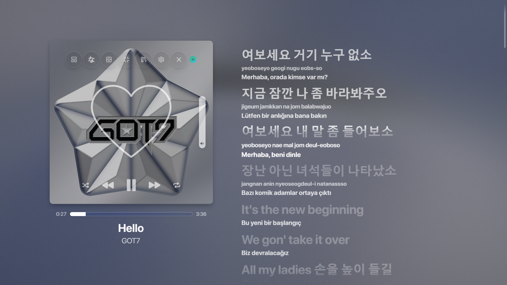

# 🔥 Spicy Lyrics AI Translator & Romaja (Spicetify Extension)

Simultaneous **Romanization (Romaja)** and **Context-Aware / Gemini AI Turkish Translations** right below your **Spicy Lyrics** lines — bringing the iconic *YouTube Music Better Lyrics* multi-line experience directly to Spotify Desktop!



## ✨ Features

* **Simultaneous Multi-Line Display:** Shows Original Lyrics (Hangul/Kanji/Thai/English) + **Romaja (Pronunciation)** + **Turkish Translation** all at once without replacing the original text.
* **Zero Blur & Crystal Clear UI:** Automatically removes Spicy Lyrics' heavy text-shadow blur on upcoming lines so subtitles are always crisp and readable.
* **Dual Translation Engine (GTX + Gemini AI):**
  * **Default Mode (`TR`):** Uses a context-aware sliding stanza neural translator with zero setup required.
  * **AI Poetic Mode (`AI`):** Right-click the `TR` button in Spicy Lyrics controls to paste a free **Google Gemini API Key** (`aistudio.google.com/apikey`). Translates idioms, slang, and metaphors across the entire song with 100% human-like accuracy!
* **Persistent Smart Cache:** Translated songs are saved locally (`localStorage`), meaning songs you replay load in `0.001s` and consume **zero** API quota!

## 🚀 Installation

### Via Spicetify Marketplace (Recommended)
1. Open **Spicetify Marketplace** in Spotify.
2. Go to **Extensions** and search for **`Spicy Lyrics AI Translator & Romaja`**.
3. Click **Install** and reload Spotify!

### Manual Installation
1. Download `spicy-tr.js` from this repository.
2. Paste it into your Spicetify Extensions folder (`%appdata%\spicetify\Extensions` on Windows).
3. Run the following commands in PowerShell / Terminal:
   ```powershell
   spicetify config extensions spicy-tr.js
   spicetify apply
   ```
## 🎮 How to Use
Make sure Spicy Lyrics is installed and its built-in A (Romanization) toggle is turned OFF (so original characters are visible).

Left-Click the TR / AI button in the Spicy Lyrics control bar to toggle translations On/Off.

Right-Click the TR / AI button to enter or remove your free Gemini API Key.

Developed with ❤️ by @korelili
